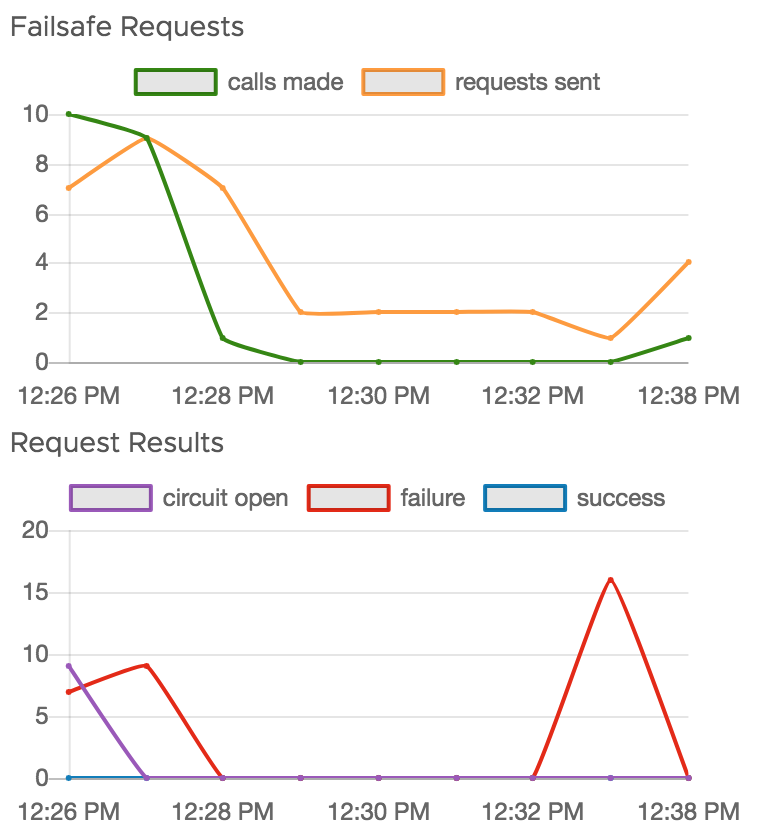
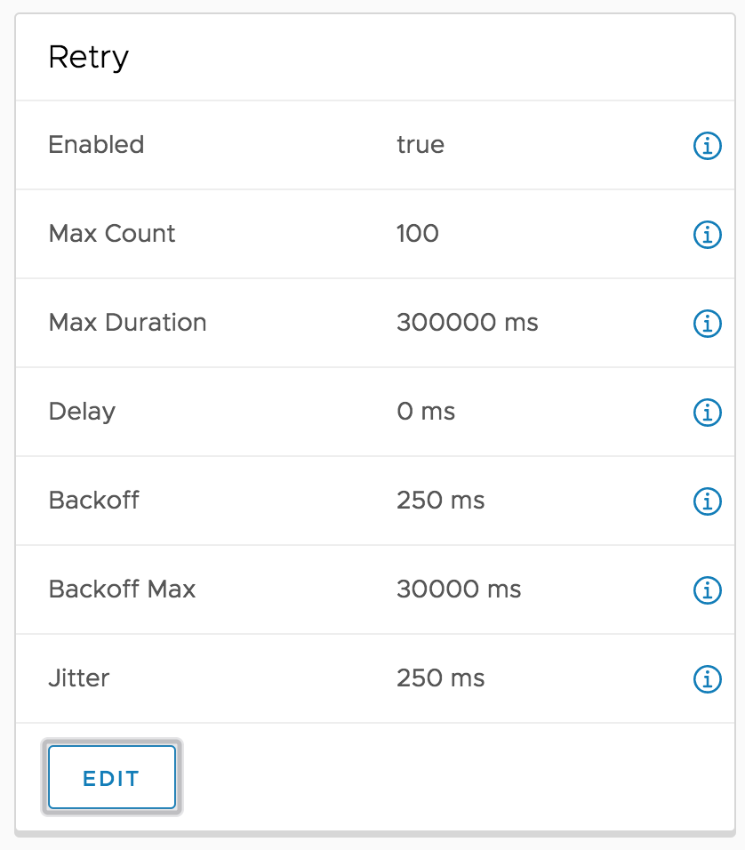
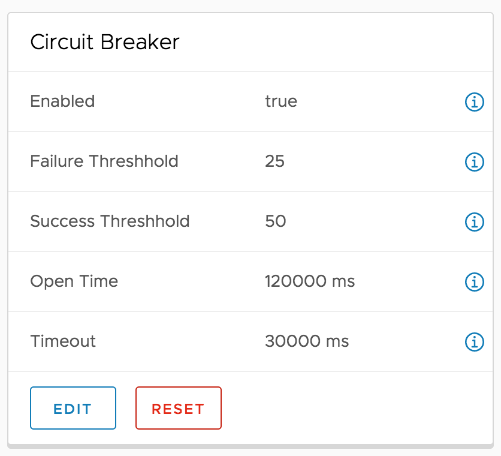

# Xenon Failsafe

Xenon Failsafe is a lightweight library for handling request failures across xenon microservices using retry and circuit breaker rules

## Authors

Chris Todd <toddc@vmware.com>
Akshay Chitneni <achitneni@vmware.com>

## Instrumentation

## Automatic Retry with Exponential Backoff

## Circuit Breaker
Prevents cascading failures

### Quick Start

mvn install

add to your project pom.xml 

    <dependency>
        <groupId>com.vmware.xenon</groupId>
        <artifactId>xenon-failsafe</artifactId>
        <version>1.5.7</version>
    </dependency>

extend FailsafeServiceHost instead of ServiceHost

    - public class MyAppServiceHost extends ServiceHost {
    + public class MyAppServiceHost extends FailsafeServiceHost {

to configure, start your service and go to http://localhost:8000/core/ui/failsafe

Add rules to a resource file src/main/resources/failsafe.json to load on startup, or configure at runtime with REST API

=REST API=

add rules to failsafe.json
post a failsafe rule to http://localhost:8000/core/failsafe

{
  prefix: "http://mgmt.api.vmware.com/",
  retryEnabled: true,
  retryMaxCount: 10,
  retryMaxDurationMs: 60000,
  retryDelayMs: 250,
  retryBackoffMs: 500,
  retryJitterMs: 100,
  breakerEnabled: true,
  breakerFailureThreshold: 5,
  breakerOpenTimeMs: 30000,
  breakerSuccessThreshold: 5,
  breakerTimeout: 30000
}

Reset the circuitbreaker state for a rule. 
POST to http://localhost:8000/core/failsafe/circuit/reset

{
  prefix: "http://mgmt.api.vmware.com/"
}

Reset the initial ruleset loaded from the resource file. 
POST to  http://localhost:8000/core/failsafe/rules/reset

This api loads the default rules from file failsafe.json in resources and creates if the rules do not exist or updates the rules with settings from the file. 

=Development=

mvn package    # download dependencies, compile source code, run tests, build jar files
java -jar target/xenon-failsafe-1.0-SNAPSHOT-jar-with-dependencies.jar   # run Xenon standalone java application

/*
 * Copyright (c) 2018 VMware, Inc. All Rights Reserved.
 *
 * Licensed under the Apache License, Version 2.0 (the "License"); you may not
 * use this file except in compliance with the License.  You may obtain a copy of
 * the License at http://www.apache.org/licenses/LICENSE-2.0
 *
 * Unless required by applicable law or agreed to in writing, software distributed
 * under the License is distributed on an "AS IS" BASIS, without warranties or
 * conditions of any kind, EITHER EXPRESS OR IMPLIED.  See the License for the
 * specific language governing permissions and limitations under the License.
 */
